# Detailed Implementation Plan: TMS-365 Proof of Concept (128 Items)

This document provides a comprehensive technical implementation plan to execute the **TMS-365 Proof of Concept (POC)** across all **128 requirements** specified in `TMS-365_POC_Plan_128_Items.docx` (derived from `TMS-365_ Transport Management System (003).xlsx`).

The target system is a modern Next.js 14 (App Router) + TypeScript + Prisma + PostgreSQL solution built with high aesthetic standards (Apple/SaaS design system) and seamless enterprise capabilities (SAP S/4HANA, GPS Telematics, ZKT BioTime Attendance, and Petro APP integrations).

---

## User Review Required

> [!IMPORTANT]
> **Key Architectural Decisions & User Approvals Needed:**
> 1. **Prisma Schema Expansion**: The database model requires adding specialized tables for Heavy Equipment, Bus Rostering, BioTime Attendance Logs, Petro APP Fuel Ingestion, and SAPCPI Integration Logs.
> 2. **Mock Integration Engine vs Live SAP CPI**: For the POC demonstration, SAP S/4HANA, Saudi Ex GPS, and ZKT BioTime endpoints will feature interactive, bidirectional **Simulation & Mock Connectors** with live payload inspection, standard JSON schemas, and webhooks.
> 3. **AI Recommendation Engine**: Item #35 and #109 require a "Sell or Keep" asset recommendation model. We will implement a rule-based cost-per-km and cumulative maintenance threshold calculation engine with interactive visual gauges.

---

## Workstream & Component Breakdown (All 128 Items)

```mermaid
graph TD
    A[TMS-365 POC Platform] --> B[Phase 1: Foundation & Core MDM]
    A --> C[Phase 2: Operational Modules]
    A --> D[Phase 3: Integrations & Telematics]
    A --> E[Phase 4: Workflow Engine & Analytics]
    A --> F[Phase 5: Governance, Quality & Rollout]

    B --> B1[Governance Items #1-5]
    B --> B2[Master Data Items #6-13]
    B --> B3[Documentation Items #14-22]

    C --> C1[Light Vehicle Items #23-37]
    C --> C2[Bus Transportation Items #38-45]
    C --> C3[Heavy Equipment Items #46-59]
    C --> C4[Driver & Safety Items #64-71]
    C --> C5[Violations & Compliance Items #72-75]
    C --> C6[Vendor & RFQ Items #60-63]

    D --> D1[GPS & Geo-Fencing Items #76-80]
    D --> D2[SAP CPI Integration Items #81-93]

    E --> E1[Workflow Builder Items #94-102]
    E --> E2[Dashboards & Reports Items #103-113]

    F --> F1[Technical Security Items #114-121]
    F --> F2[Training & Go-Live Items #122-128]
```



---

### Workstream 1: Project Governance & Inception (Items #1 – #5)

* **Scope**: Deliver foundational project management deliverables and live governance portal views within the web application.
* **Items Covered**:
  * #### [MODIFY] [Item #1](file:///e:/volviInternshipProjects/TMS/src/app/(portal)/governance/charter/page.tsx) – Project Charter & Communication Plan
  * #### [MODIFY] [Item #2](file:///e:/volviInternshipProjects/TMS/src/app/(portal)/governance/raci/page.tsx) – Roles & Responsibilities Matrix (RACI)
  * #### [MODIFY] [Item #3](file:///e:/volviInternshipProjects/TMS/src/app/(portal)/governance/risks/page.tsx) – Risk Register & Mitigation Plan
  * #### [MODIFY] [Item #4](file:///e:/volviInternshipProjects/TMS/src/app/(portal)/governance/framework/page.tsx) – Governance Framework & Escalation Matrix
  * #### [MODIFY] [Item #5](file:///e:/volviInternshipProjects/TMS/src/app/(portal)/governance/roadmap/page.tsx) – Detailed Project Plan with Interactive Gantt Milestones

---

### Workstream 2: Master Data Management (MDM) (Items #6 – #13)

* **Scope**: Centralize foundational entities across sites, routes, documents, vehicles, drivers, heavy equipment, and SAP PM maintenance alignment.
* **Items Covered**:
  * #### [NEW] [GeoLocationMaster](file:///e:/volviInternshipProjects/TMS/src/app/(portal)/mdm/locations/page.tsx) – Item #6: Sites, depots, pickup/drop points, and geofence definitions.
  * #### [NEW] [RouteMaster](file:///e:/volviInternshipProjects/TMS/src/app/(portal)/mdm/routes/page.tsx) – Item #7: Origin, destination, waypoints, distance (km), and estimated travel time.
  * #### [NEW] [ComplianceMaster](file:///e:/volviInternshipProjects/TMS/src/app/(portal)/mdm/compliance-types/page.tsx) – Item #8: Document categories (Istimara, MVPI, Insurance, TGA Permits) with SLA threshold alerts.
  * #### [NEW] [LightVehicleMaster](file:///e:/volviInternshipProjects/TMS/src/app/(portal)/mdm/vehicles-light/page.tsx) – Item #9: Light vehicle fleet master with employee grade (M1/M2/M3) eligibility matrix.
  * #### [NEW] [BusPassengerMapping](file:///e:/volviInternshipProjects/TMS/src/app/(portal)/mdm/buses/page.tsx) – Item #10: Bus master, driver allocation, and shift passenger mapping.
  * #### [NEW] [HeavyEquipmentMaster](file:///e:/volviInternshipProjects/TMS/src/app/(portal)/mdm/heavy-equipment/page.tsx) – Item #11: Heavy vehicle, crane/loader master, and operating permit registry.
  * #### [NEW] [MaintenanceMaster](file:///e:/volviInternshipProjects/TMS/src/app/(portal)/mdm/maintenance-plans/page.tsx) – Item #12: SAP PM aligned maintenance schedules and condition codes.
  * #### [NEW] [DataQualityEngine](file:///e:/volviInternshipProjects/TMS/src/app/(portal)/mdm/data-quality/page.tsx) – Item #13: Duplicate prevention rules, field validation schemas (Zod), and reconciliation logs.

---

### Workstream 3: Enterprise Architecture & Blueprinting (Items #14 – #22)

* **Scope**: Provide embedded documentation, architecture blueprints, data migration utilities, and UAT readiness logs directly inside the system settings/documentation hub.
* **Items Covered**:
  * #### [NEW] [AS-IS Process Vault](file:///e:/volviInternshipProjects/TMS/src/app/(portal)/docs/as-is/page.tsx) – Item #14: Legacy process workflows and baseline documentation.
  * #### [NEW] [TO-BE Business Blueprint](file:///e:/volviInternshipProjects/TMS/src/app/(portal)/docs/to-be/page.tsx) – Item #15: Target process flows for LV, Heavy, Bus, and SAP CPI.
  * #### [NEW] [Integration Blueprint](file:///e:/volviInternshipProjects/TMS/src/app/(portal)/docs/integration-arch/page.tsx) – Item #16: SAP CPI, Saudi Ex GPS, Petro APP, and BioTime payload specs.
  * #### [NEW] [Security & RBAC Architecture](file:///e:/volviInternshipProjects/TMS/src/app/(portal)/docs/security/page.tsx) – Item #17: Matrix of roles, permissions, data privacy, and encryption details.
  * #### [NEW] [Infrastructure Blueprint](file:///e:/volviInternshipProjects/TMS/src/app/(portal)/docs/infrastructure/page.tsx) – Item #18: Cloud topology, HA/DR setup, and container scaling.
  * #### [NEW] [Data Migration Strategy](file:///e:/volviInternshipProjects/TMS/src/app/(portal)/docs/migration/page.tsx) – Item #19: Field mapping rules, staging tables, and migration validation scripts.
  * #### [NEW] [SOPs & User Manuals](file:///e:/volviInternshipProjects/TMS/src/app/(portal)/docs/sops/page.tsx) – Item #20: Interactive user guides for Admins, Drivers, Approvers, and Passengers.
  * #### [NEW] [Test Strategy & UAT Hub](file:///e:/volviInternshipProjects/TMS/src/app/(portal)/docs/uat-plan/page.tsx) – Item #21: Detailed UAT test scripts, expected outputs, and sign-off logs.
  * #### [NEW] [Cutover Strategy](file:///e:/volviInternshipProjects/TMS/src/app/(portal)/docs/cutover/page.tsx) – Item #22: Go-live checklist, system freeze timelines, and fallback procedures.

---

### Workstream 4: Light Vehicle Management (LV) (Items #23 – #37)

* **Scope**: Complete lifecycle management of light vehicles (company owned & leased), employee requests, grade eligibility, auto-allocation, damage tracking, and maintenance sell/keep intelligence.
* **Items Covered**:
  * #### [MODIFY] [Vehicle Request Portal](file:///e:/volviInternshipProjects/TMS/src/app/(portal)/light-vehicles/requests/page.tsx) – Item #23: Self-service employee vehicle booking portal.
  * #### [MODIFY] [Multi-Tier Approval Workflow](file:///e:/volviInternshipProjects/TMS/src/app/(portal)/light-vehicles/approvals/page.tsx) – Item #24: Manager, HR, and Transport Admin approval chain.
  * #### [MODIFY] [Vehicle Allocation Manager](file:///e:/volviInternshipProjects/TMS/src/app/(portal)/light-vehicles/allocations/page.tsx) – Item #25: Fleet dispatch & key handover management.
  * #### [NEW] [Smart Auto-Allocation Engine](file:///e:/volviInternshipProjects/TMS/src/app/(portal)/light-vehicles/auto-allocation/page.tsx) – Item #26 & Item #29: Recommendation algorithm balancing proximity, fuel efficiency, grade, and maintenance status.
  * #### [NEW] [Vehicle Pool & Grade Matrix](file:///e:/volviInternshipProjects/TMS/src/app/(portal)/light-vehicles/grade-matrix/page.tsx) – Item #27: Grade M1/M2/M3 vehicle eligibility rules and engine displacement restrictions.
  * #### [NEW] [Owned vs Leased Segregation](file:///e:/volviInternshipProjects/TMS/src/app/(portal)/light-vehicles/fleet-ownership/page.tsx) – Item #28: Financial segregation, lease contract expiration tracking, and vendor monthly billing.
  * #### [NEW] [Breakdown & Emergency Workflows](file:///e:/volviInternshipProjects/TMS/src/app/(portal)/light-vehicles/breakdowns/page.tsx) – Item #30: Instant SOS breakdown reporting, replacement vehicle dispatch, and towing log.
  * #### [MODIFY] [Compliance & Document Vault](file:///e:/volviInternshipProjects/TMS/src/app/(portal)/light-vehicles/compliance/page.tsx) – Item #31: Istimara, MVPI, and Insurance validity countdowns with auto-notifications.
  * #### [NEW] [Financial Cross-Charging](file:///e:/volviInternshipProjects/TMS/src/app/(portal)/light-vehicles/cross-charge/page.tsx) – Item #32: Cost center allocation and SAP MM/CO billing export.
  * #### [NEW] [Ownership Transfer & Custody Log](file:///e:/volviInternshipProjects/TMS/src/app/(portal)/light-vehicles/custody-history/page.tsx) – Item #33: Chain of ownership history, driver handovers, and return checklists.
  * #### [NEW] [HR Grade Override Workflow](file:///e:/volviInternshipProjects/TMS/src/app/(portal)/light-vehicles/hr-overrides/page.tsx) – Item #34: HR exception requests for non-standard vehicle eligibility overrides.
  * #### [NEW] [Asset Health & Sell / Keep Model](file:///e:/volviInternshipProjects/TMS/src/app/(portal)/light-vehicles/asset-intelligence/page.tsx) – Item #35: Comprehensive cost tracking, accident log, fuel efficiency analysis, and ML/rule-based **"Sell or Keep"** decision model.
  * #### [NEW] [Odometer & Fuel Logging](file:///e:/volviInternshipProjects/TMS/src/app/(portal)/light-vehicles/odometer/page.tsx) – Item #36: Odometer reading validation, mileage anomalies, and fuel card logs.
  * #### [NEW] [Vehicle Handover Inspection](file:///e:/volviInternshipProjects/TMS/src/app/(portal)/light-vehicles/handover-check/page.tsx) – Item #37: Digital condition checklist, photo capture for damages, and fuel level recording.

---

### Workstream 5: Bus Management & Employee Transportation (BUS) (Items #38 – #45)

* **Scope**: Shift-based employee shuttle management, fixed route scheduling, seat occupancy heatmaps, bio-metric boarding, and real-time bus tracking.
* **Items Covered**:
  * #### [NEW] [Shift Route Planner](file:///e:/volviInternshipProjects/TMS/src/app/(portal)/buses/routes/page.tsx) – Item #38: Master schedule for morning/evening employee shift transport.
  * #### [NEW] [Passenger Rostering Portal](file:///e:/volviInternshipProjects/TMS/src/app/(portal)/buses/roster/page.tsx) – Item #39: Employee shift booking, stop selection, and pickup pass generation.
  * #### [NEW] [Seat Occupancy Visualizer](file:///e:/volviInternshipProjects/TMS/src/app/(portal)/buses/capacity/page.tsx) – Item #40: Interactive bus seating chart, capacity heatmap, and overload alerts.
  * #### [NEW] [Live Shuttle Tracker](file:///e:/volviInternshipProjects/TMS/src/app/(portal)/buses/live-map/page.tsx) – Item #41: GPS shuttle map with dynamic ETA calculations for upcoming stops.
  * #### [NEW] [Boarding Verification Console](file:///e:/volviInternshipProjects/TMS/src/app/(portal)/buses/boarding/page.tsx) – Item #42: QR code / NFC / BioTime passenger validation at bus entry.
  * #### [NEW] [Route Optimizer Engine](file:///e:/volviInternshipProjects/TMS/src/app/(portal)/buses/route-optimization/page.tsx) – Item #43: Dynamic re-routing based on shift demand and traffic conditions.
  * #### [NEW] [Contingency Bus Replacement](file:///e:/volviInternshipProjects/TMS/src/app/(portal)/buses/contingency/page.tsx) – Item #44: Emergency bus swap workflow and instant passenger SMS/Push notifications.
  * #### [NEW] [Passenger Experience Rating](file:///e:/volviInternshipProjects/TMS/src/app/(portal)/buses/feedback/page.tsx) – Item #45: Ride feedback, AC/cleanliness rating, and driver behavior scoring.

---

### Workstream 6: Heavy Vehicle & Equipment Management (HV) (Items #46 – #59)

* **Scope**: Special equipment (Cranes, Forklifts, Heavy Trucks) lifecycle, TGA operating permits, operator certification, hour meter tracking, and SAP PM work order sync.
* **Items Covered**:
  * #### [NEW] [Heavy Equipment Registry](file:///e:/volviInternshipProjects/TMS/src/app/(portal)/heavy-equipment/registry/page.tsx) – Item #46: Machine specifications, load capacities, and TGA permit classification.
  * #### [NEW] [Job Site Dispatch Center](file:///e:/volviInternshipProjects/TMS/src/app/(portal)/heavy-equipment/dispatch/page.tsx) – Item #47: Daily job site dispatch, work order linking, and operator assignment.
  * #### [NEW] [Operator Certification Matrix](file:///e:/volviInternshipProjects/TMS/src/app/(portal)/heavy-equipment/operators/page.tsx) – Item #48: Operator heavy license validation, safety certification expiry, and authorization checks.
  * #### [NEW] [Hour Meter Log Engine](file:///e:/volviInternshipProjects/TMS/src/app/(portal)/heavy-equipment/hour-meters/page.tsx) – Item #49: Engine operating hours, idle time ratio, and preventive maintenance triggers.
  * #### [NEW] [SAP PM Maintenance Linkage](file:///e:/volviInternshipProjects/TMS/src/app/(portal)/heavy-equipment/sap-pm/page.tsx) – Item #50: Bidirectional synchronization with SAP PM Work Orders and vehicle lockout status.
  * #### [NEW] [Multi-Site Transfer Workflow](file:///e:/volviInternshipProjects/TMS/src/app/(portal)/heavy-equipment/site-transfers/page.tsx) – Item #51: Project-to-project equipment movement requests, lowboy transport booking, and arrival sign-off.
  * #### [NEW] [Heavy Fuel Consumption Log](file:///e:/volviInternshipProjects/TMS/src/app/(portal)/heavy-equipment/fuel-logs/page.tsx) – Item #52: Petro APP integration for heavy machinery, liters per hour calculations, and anomaly flagging.
  * #### [NEW] [Pre-Op Safety Checklist](file:///e:/volviInternshipProjects/TMS/src/app/(portal)/heavy-equipment/pre-op-checks/page.tsx) – Item #53: Daily digital safety inspection (hydraulics, brakes, tires) before machine start.
  * #### [NEW] [Load & Weight Limit Monitor](file:///e:/volviInternshipProjects/TMS/src/app/(portal)/heavy-equipment/load-compliance/page.tsx) – Item #54: Axle weight limits, MIZAN scale compliance, and overload penalty prevention.
  * #### [NEW] [Idle Time & Utilization Analytics](file:///e:/volviInternshipProjects/TMS/src/app/(portal)/heavy-equipment/utilization/page.tsx) – Item #55: Operational vs idle engine hours analysis to cut unnecessary fuel burn.
  * #### [NEW] [Incident & Damage Vault](file:///e:/volviInternshipProjects/TMS/src/app/(portal)/heavy-equipment/incidents/page.tsx) – Item #56: On-site equipment damage logging, photo evidence, and insurance claim tracking.
  * #### [NEW] [Sub-contracted Heavy Fleet](file:///e:/volviInternshipProjects/TMS/src/app/(portal)/heavy-equipment/leased-machinery/page.tsx) – Item #57: Rental crane/equipment contracts, hourly rate validation, and vendor timesheet approvals.
  * #### [NEW] [Site Geofence Operations Limit](file:///e:/volviInternshipProjects/TMS/src/app/(portal)/heavy-equipment/geofences/page.tsx) – Item #58: Restricting heavy machinery operation to designated construction zones with instant alerts.
  * #### [NEW] [Equipment Demobilization Workflow](file:///e:/volviInternshipProjects/TMS/src/app/(portal)/heavy-equipment/demob/page.tsx) – Item #59: De-hiring workflow, off-rent inspections, and final billing reconciliation.

---

### Workstream 7: Vendor & RFQ Management (VRFQ) (Items #60 – #63)

* **Scope**: Third-party transport provider onboarding, rate cards, competitive RFQ bidding, and automated SLA penalty calculations.
* **Items Covered**:
  * #### [MODIFY] [Vendor Portal](file:///e:/volviInternshipProjects/TMS/src/app/(portal)/vendors/list/page.tsx) – Item #60: Vendor onboarding, contract validity badges, and compliance documents.
  * #### [MODIFY] [Tariff & Rate Card Manager](file:///e:/volviInternshipProjects/TMS/src/app/(portal)/vendors/rate-cards/page.tsx) – Item #61: Base rate, per-km rate, waiting charges, and vehicle category price matrices.
  * #### [MODIFY] [Automated RFQ & Bidding Hub](file:///e:/volviInternshipProjects/TMS/src/app/(portal)/vendors/rfq/page.tsx) – Item #62: Broadcast spot transport requests to eligible vendors, automated bid comparison, and award workflows.
  * #### [MODIFY] [Vendor SLA & Performance Scorecard](file:///e:/volviInternshipProjects/TMS/src/app/(portal)/vendors/scorecards/page.tsx) – Item #63: On-time delivery %, vehicle condition ratings, and automated penalty billing.

---

### Workstream 8: Driver Management & Safety (DM) (Items #64 – #71)

* **Scope**: Complete driver profiles, Saudi driving license & Iqama tracking, fatigue compliance, BioTime attendance sync, and driver scorecards.
* **Items Covered**:
  * #### [MODIFY] [Driver Vault](file:///e:/volviInternshipProjects/TMS/src/app/(portal)/drivers/list/page.tsx) – Item #64: Driver credentials, license category, medical certificates, and Iqama expiry.
  * #### [NEW] [Duty Roster & Hours-of-Service](file:///e:/volviInternshipProjects/TMS/src/app/(portal)/drivers/duty-roster/page.tsx) – Item #65: Shift rostering, mandatory rest period enforcement, and driving hour caps.
  * #### [MODIFY] [Driver Scorecard & Safety Index](file:///e:/volviInternshipProjects/TMS/src/app/(portal)/drivers/safety-scorecard/page.tsx) – Item #66: Telematics-driven driver scoring (harsh braking, speeding, idling, late arrivals).
  * #### [NEW] [Driver-Vehicle Assignment Matrix](file:///e:/volviInternshipProjects/TMS/src/app/(portal)/drivers/assignments/page.tsx) – Item #67: Vehicle allocation, key sign-out, and active duty status.
  * #### [NEW] [BioTime Attendance Connector](file:///e:/volviInternshipProjects/TMS/src/app/(portal)/drivers/attendance/page.tsx) – Item #68: Integration with ZKT BioTime biometric devices for clock-in/clock-out verification.
  * #### [NEW] [Driver PWA Mobile Console](file:///e:/volviInternshipProjects/TMS/src/app/(portal)/driver-portal/page.tsx) – Item #69: Dedicated mobile interface for drivers to view trips, navigate, and record fuel receipts.
  * #### [NEW] [Medical & Drug Compliance Monitor](file:///e:/volviInternshipProjects/TMS/src/app/(portal)/drivers/medical/page.tsx) – Item #70: Health checkup schedule, drug screening logs, and fitness-for-duty clearance.
  * #### [NEW] [Driver Incentive & Fine Ledger](file:///e:/volviInternshipProjects/TMS/src/app/(portal)/drivers/incentives/page.tsx) – Item #71: Safety bonus calculations, traffic fine allocations, and payroll deduction summaries.

---

### Workstream 9: Vehicle Violations & Compliance (VVC) (Items #72 – #75)

* **Scope**: Automated traffic violation ingestion, speeding alerts, government portal (Naql/Absher) matching, appeal workflows, and cost center deduction.
* **Items Covered**:
  * #### [MODIFY] [Violation Ingestion Center](file:///e:/volviInternshipProjects/TMS/src/app/(portal)/violations/ingestion/page.tsx) – Item #72 & #73: Capture violations from GPS telematics, manual reports, and mock government portals.
  * #### [MODIFY] [Violation Dispute & Appeal Workflow](file:///e:/volviInternshipProjects/TMS/src/app/(portal)/violations/disputes/page.tsx) – Item #74: Multi-stage review (Driver -> Fleet Mgr -> HR) to confirm driver accountability.
  * #### [MODIFY] [Financial Penalty Cross-Charge](file:///e:/volviInternshipProjects/TMS/src/app/(portal)/violations/accounting/page.tsx) – Item #75: Link violation fines to specific driver payroll or department cost centers.

---

### Workstream 10: Geo-Fencing & GPS Tracking (GPS) (Items #76 – #80)

* **Scope**: Live fleet map with Leaflet / Mapbox, polygonal geofences, speed alerts, telemetry playback, and Saudi Ex GPS API connector.
* **Items Covered**:
  * #### [MODIFY] [Live Fleet Tracking Map](file:///e:/volviInternshipProjects/TMS/src/app/(portal)/gps/map/page.tsx) – Item #76: Real-time map displaying vehicle locations, engine status, and speed.
  * #### [MODIFY] [Geofence Polygon Builder](file:///e:/volviInternshipProjects/TMS/src/app/(portal)/gps/geofences/page.tsx) – Item #77: Interactive draw tool for site perimeters, depots, and restricted zones.
  * #### [NEW] [Telematics Alert Engine](file:///e:/volviInternshipProjects/TMS/src/app/(portal)/gps/alerts/page.tsx) – Item #78: Real-time trigger rules for geofence breaches, speeding, and unauthorized movement.
  * #### [NEW] [Historical Telematics Playback](file:///e:/volviInternshipProjects/TMS/src/app/(portal)/gps/playback/page.tsx) – Item #79: Replay historical vehicle routes with timeline scrubbing and speed profiles.
  * #### [NEW] [Saudi Ex Telematics API Connector](file:///e:/volviInternshipProjects/TMS/src/app/(portal)/gps/saudi-ex-api/page.tsx) – Item #80: Standard API integration hub for ingesting vendor GPS telemetry streams.

---

### Workstream 11: SAP S/4HANA Integration (SAP) (Items #81 – #93)

* **Scope**: Complete SAP CPI / PI-PO integration suite connecting HCM, PM, MM, CO, PS, Petro APP, BioTime, and Naql/TGA.
* **Items Covered**:
  * #### [NEW] [SAP HCM Employee Sync](file:///e:/volviInternshipProjects/TMS/src/app/(portal)/integrations/sap-hcm/page.tsx) – Item #81 & #82: Ingest employee master, organizational units, and leave status.
  * #### [NEW] [SAP PM Asset & Maintenance Sync](file:///e:/volviInternshipProjects/TMS/src/app/(portal)/integrations/sap-pm/page.tsx) – Item #83 & #85: Equipment synchronization and auto-lockout during scheduled PM.
  * #### [NEW] [SAP MM Vendor & Procurement Sync](file:///e:/volviInternshipProjects/TMS/src/app/(portal)/integrations/sap-mm/page.tsx) – Item #84 & #87: Vendor master data, PO creation, and automated cross-charging.
  * #### [NEW] [SAP PS / CO Cost Center Sync](file:///e:/volviInternshipProjects/TMS/src/app/(portal)/integrations/sap-co/page.tsx) – Item #86: WBS elements, internal orders, and transport expense allocation.
  * #### [NEW] [SAP Fiori & Notification Gateway](file:///e:/volviInternshipProjects/TMS/src/app/(portal)/integrations/sap-notifications/page.tsx) – Item #88: Push notifications to SAP Fiori Inbox, SMS, and email.
  * #### [NEW] [Saudi Ex GPS Telematics API](file:///e:/volviInternshipProjects/TMS/src/app/(portal)/integrations/saudi-ex/page.tsx) – Item #89: Raw telematics ingestion and signal processing interface.
  * #### [NEW] [BioTime Attendance API Bridge](file:///e:/volviInternshipProjects/TMS/src/app/(portal)/integrations/biotime/page.tsx) – Item #90: Real-time punch-in/out event stream connector.
  * #### [NEW] [Petro APP Fuel Consumption API](file:///e:/volviInternshipProjects/TMS/src/app/(portal)/integrations/petro-app/page.tsx) – Item #91: Digital fuel transaction logs, liters, fuel station location, and odometer validation.
  * #### [NEW] [KSA TGA / Naql / MIZAN Regulatory Sync](file:///e:/volviInternshipProjects/TMS/src/app/(portal)/integrations/tga-naql/page.tsx) – Item #92: Transport General Authority license validation and weight compliance API.
  * #### [NEW] [SAP CPI Integration Monitor & Log Console](file:///e:/volviInternshipProjects/TMS/src/app/(portal)/integrations/cpi-monitor/page.tsx) – Item #93: Live payload inspector, retry queue, status code metrics, and error logs.

---

### Workstream 12: Visual Workflow Builder & Approvals (WF) (Items #94 – #102)

* **Scope**: Drag-and-drop workflow designer, dynamic approval chains, SLA auto-escalation, and condition nodes.
* **Items Covered**:
  * #### [MODIFY] [Visual Workflow Canvas](file:///e:/volviInternshipProjects/TMS/src/app/(portal)/workflows/builder/page.tsx) – Item #94: Interactive React Flow based visual node canvas for workflow creation.
  * #### [MODIFY] [Multi-Tier Approval Rules](file:///e:/volviInternshipProjects/TMS/src/app/(portal)/workflows/rules/page.tsx) – Item #95: Dynamic approval matrix by request amount, employee grade, and vehicle category.
  * #### [NEW] [Escalation & SLA Engine](file:///e:/volviInternshipProjects/TMS/src/app/(portal)/workflows/escalations/page.tsx) – Item #96 & #101: Auto-reassignment and manager notification if approval pending > X hours.
  * #### [NEW] [Event Trigger Nodes](file:///e:/volviInternshipProjects/TMS/src/app/(portal)/workflows/triggers/page.tsx) – Item #97: System triggers for document expiry, maintenance alert, or violation threshold.
  * #### [NEW] [Notification Node Config](file:///e:/volviInternshipProjects/TMS/src/app/(portal)/workflows/notifications/page.tsx) – Item #98: Custom template builder for Email, SMS, App Push, and SAP Fiori.
  * #### [NEW] [Eligibility Rule Builder](file:///e:/volviInternshipProjects/TMS/src/app/(portal)/workflows/eligibility-rules/page.tsx) – Item #99: Grade-to-vehicle matching logic and exception rules.
  * #### [NEW] [Workflow Execution Audit Log](file:///e:/volviInternshipProjects/TMS/src/app/(portal)/workflows/audit-logs/page.tsx) – Item #100: Step-by-step audit history of every triggered workflow instance.
  * #### [NEW] [Workflow Import / Export Hub](file:///e:/volviInternshipProjects/TMS/src/app/(portal)/workflows/version-control/page.tsx) – Item #102: JSON export/import of workflow templates and version history.

---

### Workstream 13: Reporting, Dashboards & Analytics (RPT) (Items #103 – #113)

* **Scope**: Executive, Operational, HR, and Passenger dashboards, Power BI export pipeline, predictive analytics, and what-if simulation models.
* **Items Covered**:
  * #### [NEW] [Executive Management Dashboard](file:///e:/volviInternshipProjects/TMS/src/app/(portal)/analytics/executive/page.tsx) – Item #103: High-level KPIs: Total fleet cost, compliance rating, SLA performance, and ROI.
  * #### [NEW] [Operations & Dispatch Command Center](file:///e:/volviInternshipProjects/TMS/src/app/(portal)/analytics/operations/page.tsx) – Item #104: Live fleet availability, active trips, breakdown tickets, and delay heatmaps.
  * #### [NEW] [HR & Department Utilization Dashboard](file:///e:/volviInternshipProjects/TMS/src/app/(portal)/analytics/hr-dept/page.tsx) – Item #105: Department wise transport expenditure, passenger volume, and grade distribution.
  * #### [NEW] [Employee Shuttle Portal Dashboard](file:///e:/volviInternshipProjects/TMS/src/app/(portal)/analytics/passenger-portal/page.tsx) – Item #106: Personal trip history, assigned shuttle schedule, and driver ratings.
  * #### [NEW] [Custom KPI Builder](file:///e:/volviInternshipProjects/TMS/src/app/(portal)/analytics/kpi-config/page.tsx) – Item #107: Configure custom metrics, threshold colors, and target benchmarks.
  * #### [NEW] [Fleet Capacity Optimizer](file:///e:/volviInternshipProjects/TMS/src/app/(portal)/analytics/capacity-planner/page.tsx) – Item #108: Vehicle utilization rates, peak time load analysis, and right-sizing suggestions.
  * #### [NEW] [Predictive Asset Intelligence Engine](file:///e:/volviInternshipProjects/TMS/src/app/(portal)/analytics/predictive-maintenance/page.tsx) – Item #109: Predictive maintenance cost curves and **"Sell or Keep"** replacement recommendations.
  * #### [NEW] [SAP Financial & Cross-Charge Reports](file:///e:/volviInternshipProjects/TMS/src/app/(portal)/analytics/sap-financials/page.tsx) – Item #110: Cost center summaries, project WBS billing, and vendor invoice reconciliation.
  * #### [NEW] [Power BI Data Pipeline & Exposure Layer](file:///e:/volviInternshipProjects/TMS/src/app/(portal)/analytics/powerbi-export/page.tsx) – Item #111: OData / REST API endpoints for direct Power BI dataset ingestion.
  * #### [NEW] [Automated Report Scheduler](file:///e:/volviInternshipProjects/TMS/src/app/(portal)/analytics/report-scheduler/page.tsx) – Item #112: PDF/Excel report export scheduling via email/S3.
  * #### [NEW] [What-If Demand Simulator](file:///e:/volviInternshipProjects/TMS/src/app/(portal)/analytics/what-if-simulator/page.tsx) – Item #113: Interactive scenario planning (e.g., +20% shift workers, fuel price fluctuation impact).

---

### Workstream 14: Technical, Security & Infrastructure (TECH) (Items #114 – #121)

* **Scope**: Enterprise cloud deployment architecture, RBAC authorization, AES-256 encryption, UAT script execution log, and performance metrics.
* **Items Covered**:
  * #### [NEW] [Cloud HA & DR Architecture Center](file:///e:/volviInternshipProjects/TMS/src/app/(portal)/admin/infrastructure-status/page.tsx) – Item #114: Live status dashboard of cloud nodes, database replication, and failover health.
  * #### [NEW] [Environment Config & Sync Log](file:///e:/volviInternshipProjects/TMS/src/app/(portal)/admin/environments/page.tsx) – Item #115: Config management across DEV, UAT, and PROD.
  * #### [NEW] [Role-Based Access Control Matrix](file:///e:/volviInternshipProjects/TMS/src/app/(portal)/admin/rbac/page.tsx) – Item #116: User role assignment, permission scopes, and department restrictions.
  * #### [NEW] [Security Audit & Encryption Status](file:///e:/volviInternshipProjects/TMS/src/app/(portal)/admin/security-audit/page.tsx) – Item #117: Encryption status (AES-256 at rest, TLS 1.3 in transit), vulnerability log, and OWASP compliance.
  * #### [NEW] [UAT Test Execution Suite](file:///e:/volviInternshipProjects/TMS/src/app/(portal)/admin/uat-executor/page.tsx) – Item #118: Interactive test execution matrix for 128 items with pass/fail toggle and evidence upload.
  * #### [NEW] [Performance & Scalability Metrics](file:///e:/volviInternshipProjects/TMS/src/app/(portal)/admin/performance/page.tsx) – Item #119: Page response times, API latency, database query times, and concurrent user metrics.
  * #### [NEW] [Mobile Device Responsiveness Monitor](file:///e:/volviInternshipProjects/TMS/src/app/(portal)/admin/mobile-testing/page.tsx) – Item #120: Viewport test frame for mobile, tablet, and desktop validation.
  * #### [NEW] [Defect & RCA Tracking Log](file:///e:/volviInternshipProjects/TMS/src/app/(portal)/admin/defects-rca/page.tsx) – Item #121: Defect ticketing system with Root Cause Analysis (RCA) logs for UAT issues.

---

### Workstream 15: Training, Rollout & Post Go-Live Hypercare (TRN) (Items #122 – #128)

* **Scope**: Change management, training materials, cutover execution tracking, 2-month hypercare SLA monitoring, and project sign-off documentation.
* **Items Covered**:
  * #### [NEW] [Train-the-Trainer Center](file:///e:/volviInternshipProjects/TMS/src/app/(portal)/rollout/train-the-trainer/page.tsx) – Item #122: Core trainer slide decks, evaluation quizzes, and trainer certification logs.
  * #### [NEW] [End-User Training Hub](file:///e:/volviInternshipProjects/TMS/src/app/(portal)/rollout/user-training/page.tsx) – Item #123: Role-specific walkthrough videos, interactive simulations, and cheat sheets.
  * #### [NEW] [Post-Go-Live Adoption Review](file:///e:/volviInternshipProjects/TMS/src/app/(portal)/rollout/adoption-review/page.tsx) – Item #124: System adoption metrics, active user trends, and feature usage heatmaps.
  * #### [NEW] [Go-Live Cutover Command Center](file:///e:/volviInternshipProjects/TMS/src/app/(portal)/rollout/cutover-execution/page.tsx) – Item #125: Minute-by-minute cutover task tracker for Go-Live weekend.
  * #### [NEW] [Hypercare Support Desk](file:///e:/volviInternshipProjects/TMS/src/app/(portal)/rollout/hypercare-desk/page.tsx) – Item #126: Dedicated 60-day hypercare ticketing system with priority SLA queues.
  * #### [NEW] [Project Closure & Lessons Learned](file:///e:/volviInternshipProjects/TMS/src/app/(portal)/rollout/closure-report/page.tsx) – Item #127: Final project closure sign-off, accomplishment summary, and lessons learned vault.
  * #### [NEW] [AMS SLA Performance Reporter](file:///e:/volviInternshipProjects/TMS/src/app/(portal)/rollout/ams-sla/page.tsx) – Item #128: Application Maintenance Services SLA dashboard tracking resolution times and ticket volume.

---

## Verification Plan

### Automated Verification
```bash
# 1. Type check the TypeScript project
npx tsc --noEmit

# 2. Validate Prisma database schema
npx prisma validate

# 3. Next.js build verification
npm run build
```

### Manual & POC Demonstration Plan
1. **128-Item Demonstration Navigation Bar**: Create an overarching **"POC 128 Items Navigator"** quick-bar at the top of the application layout allowing one-click jumping to any of the 128 items with real-time status badges (Fully Available / Demonstrated).
2. **Interactive Simulation Mode**: Enable toggles on integration pages (SAP S/4HANA, Petro APP, ZKT BioTime, Saudi Ex GPS) to send sample payloads and observe real-time database updates and UI response.
3. **Executive Presentation Deck**: Provide a dedicated POC Overview dashboard summarizing the 100% completion of all 128 requirements.
